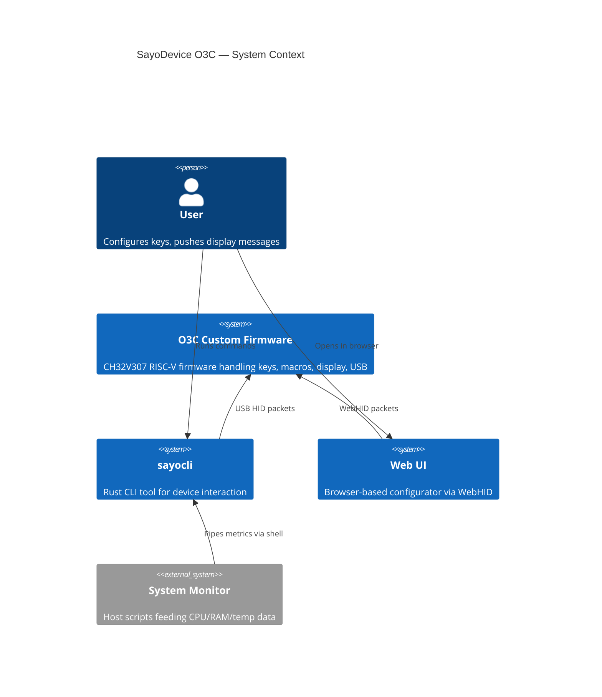
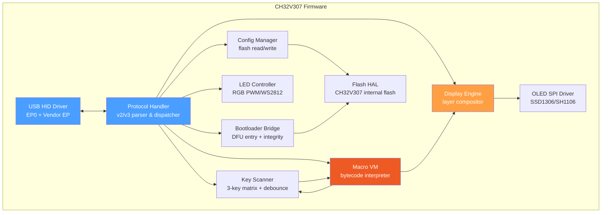
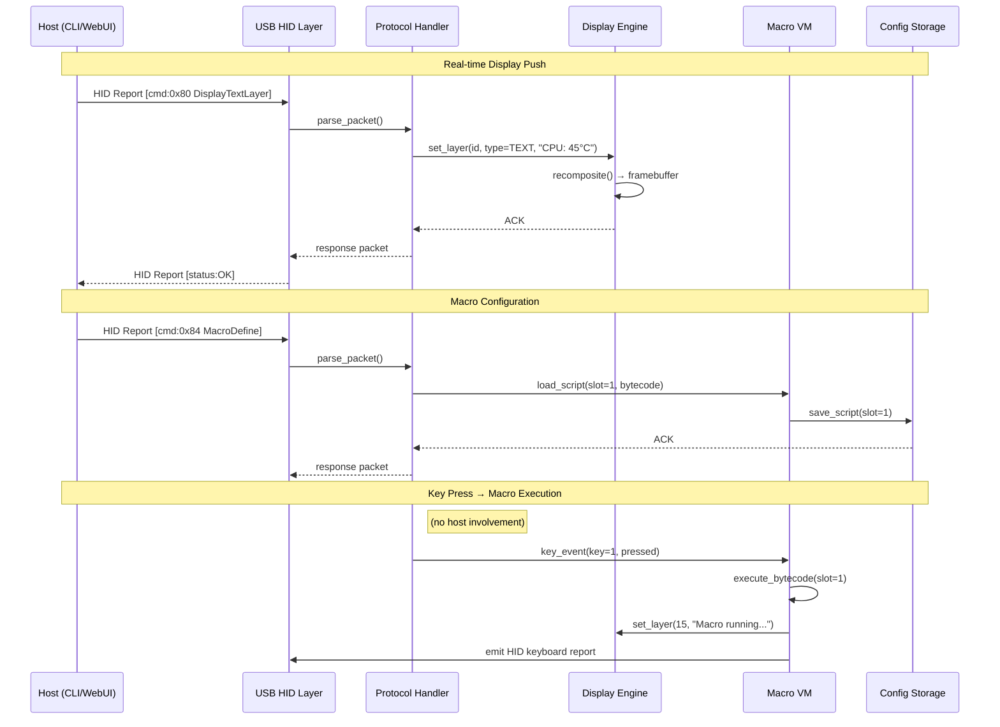
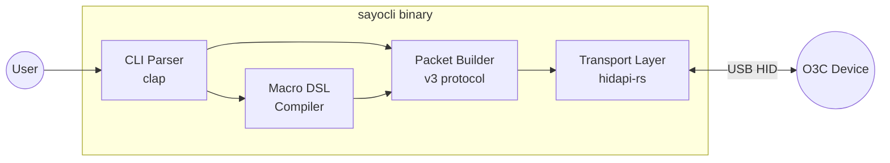
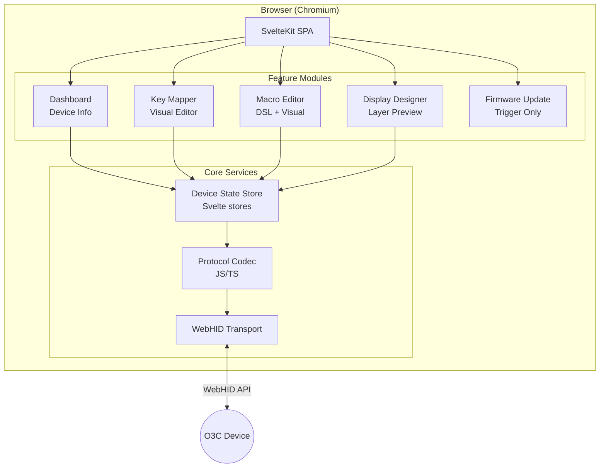

# SayoDevice O3C — Custom Firmware & Companion Software System Architecture

> **Version**: 1.0.0  
> **Date**: 2026-07-22  
> **Author**: Backend Architect (automated analysis)  
> **Status**: DRAFT — Architecture Design  
> **Prerequisite**: [Technical Reference](./sayobot-o3c-technical-reference.md)

---

## Table of Contents

1. [Executive Summary](#1-executive-summary)
2. [System Overview & Context](#2-system-overview--context)
3. [Architecture Diagrams](#3-architecture-diagrams)
4. [Firmware Architecture](#4-firmware-architecture)
5. [USB HID Protocol Specification](#5-usb-hid-protocol-specification)
6. [CLI Tool Architecture (sayocli)](#6-cli-tool-architecture-sayocli)
7. [Web UI Architecture](#7-web-ui-architecture)
8. [Data Flow & Interaction Patterns](#8-data-flow--interaction-patterns)
9. [Technology Choices & Justification](#9-technology-choices--justification)
10. [Security Considerations](#10-security-considerations)
11. [Testing Strategy](#11-testing-strategy)
12. [Open Questions & Risks](#12-open-questions--risks)

---

## 1. Executive Summary

This document defines the architecture for a three-component system that replaces the stock Sayobot O3C firmware and tools:

| Component | Purpose | Technology |
|-----------|---------|------------|
| **Custom Firmware** | Runs on the CH32V307 MCU — handles key input, macro execution, OLED display rendering, USB HID communication | C (RISC-V GCC via MounRiver) |
| **sayocli** | Host-side CLI for real-time display push, macro config, device status | Rust (cross-platform, async USB) |
| **Web UI** | Browser-based visual configurator — macro editor, display preview, device info | SvelteKit + WebHID API |

The system communicates over a **single USB HID interface** with a custom binary protocol (v3) that is backward-compatible with existing Sayo v2 framing but adds new command IDs for host-push display and richer macro definition.

### Key Design Decisions

1. **Single USB interface, multiplexed commands** — no CDC/serial, no custom drivers. HID works everywhere without driver installation.
2. **Protocol v3 extends v2 framing** — same packet structure (report_id, echo, checksum, cmd[]), new command IDs in the `0x80-0xBF` range (vendor-extended). Stock firmware commands remain functional during incremental development.
3. **Display is layer-composited on the firmware side** — the host sends text/graphic layer updates, not raw framebuffer data. This minimizes USB bandwidth and simplifies the host tools.
4. **Macro engine is a simplified register-based VM** — compatible with the stock bytecode format where possible, with an optional human-readable DSL compiled on the host side.
5. **Firmware does not depend on host software to function** — keys, macros, and saved display configs work standalone. Host tools add real-time overlay and configuration.

---

## 2. System Overview & Context

### 2.1 Physical System

```
┌─────────────────────────────────────────────────────────┐
│                    HOST COMPUTER                         │
│                                                         │
│  ┌──────────┐    ┌──────────┐    ┌──────────────────┐   │
│  │ sayocli   │    │ Web UI   │    │ Other HID apps   │   │
│  │ (Rust)    │    │ (Browser)│    │ (future)         │   │
│  └────┬─────┘    └────┬─────┘    └────────┬─────────┘   │
│       │               │                    │             │
│       │  USB HID      │  WebHID API        │ hidapi      │
│       └───────────────┴────────────────────┘             │
│                       │                                  │
└───────────────────────┼──────────────────────────────────┘
                        │ USB Cable
┌───────────────────────┼──────────────────────────────────┐
│               SAYOBOT O3C DEVICE                         │
│                       │                                  │
│  ┌────────────────────┴──────────────────────────────┐   │
│  │              USB HID Interface                     │   │
│  │   VID:0x8089  PID:0x0009  Usage:0xFF20            │   │
│  └────────────────────┬──────────────────────────────┘   │
│                       │                                  │
│  ┌────────────────────┴──────────────────────────────┐   │
│  │           CH32V307 RISC-V MCU                      │   │
│  │                                                    │   │
│  │  ┌──────────┐ ┌──────────┐ ┌──────────────────┐   │   │
│  │  │Key Input │ │ Macro VM │ │ Display Engine    │   │   │
│  │  │Handler   │ │          │ │ (OLED Compositor) │   │   │
│  │  └──────────┘ └──────────┘ └──────────────────┘   │   │
│  │  ┌──────────┐ ┌──────────┐ ┌──────────────────┐   │   │
│  │  │Config    │ │ Protocol │ │ Bootloader/DFU   │   │   │
│  │  │Storage   │ │ Handler  │ │ Entry            │   │   │
│  │  └──────────┘ └──────────┘ └──────────────────┘   │   │
│  └───────────────────────────────────────────────────┘   │
│                                                         │
│  ┌─────────┐  ┌──────┐  ┌────────┐                      │
│  │3 Cherry │  │OLED  │  │RGB LEDs│                      │
│  │MX Keys  │  │Screen│  │        │                      │
│  └─────────┘  └──────┘  └────────┘                      │
└─────────────────────────────────────────────────────────┘
```

### 2.2 Component Responsibilities

| Component | Responsibilities |
|-----------|-----------------|
| **Firmware — USB HID Layer** | Enumerate as HID device, parse/dispatch incoming command packets, serialize responses, handle report descriptors |
| **Firmware — Key Input Handler** | Debounce, scan matrix (3 keys), generate HID keyboard reports, trigger macro execution on configured key events |
| **Firmware — Macro VM** | Execute bytecode programs: keystrokes, delays, loops, conditionals, register ops. Load/store scripts from flash |
| **Firmware — Display Engine** | Composite 16 layers → framebuffer → SPI to OLED. Layer types: text, color fill, widget, image. Accept real-time updates from host |
| **Firmware — Config Storage** | Read/write configuration structs to internal flash. Wear-leveling via sequential write with generation counter |
| **Firmware — Bootloader Bridge** | Validate firmware integrity (MD5), enter DFU/bootloader mode on command, expose metadata |
| **sayocli** | Enumerate USB HID devices, send/receive protocol packets, provide subcommand interface for display/macro/status/bootloader |
| **Web UI** | Connect via WebHID, visual macro editor, display layout designer, device dashboard, firmware update trigger |

### 2.3 Constraints

| Constraint | Impact |
|------------|--------|
| CH32V307 has 256KB flash, 64KB RAM | Firmware must be compact; no dynamic allocation, no RTOS (bare-metal or FreeRTOS-lite) |
| OLED resolution ~128×64 or 128×32 (TBD from SysInfo) | Display commands must work within this pixel budget |
| USB HID max packet: 64B (normal) / 1024B (HS) | Large transfers (images, scripts) must be chunked |
| No custom USB drivers allowed | Everything goes through HID — no CDC, no bulk endpoints |
| WebHID requires Chrome/Edge (no Firefox/Safari) | Web UI is Chromium-only; CLI covers all platforms |
| Stock bootloader is proprietary (AES-encrypted firmware) | Custom firmware must either: (a) use stock bootloader with matching encryption, or (b) replace bootloader entirely via SWD/JTAG |

---

## 3. Architecture Diagrams

### 3.1 System Context Diagram



### 3.2 Firmware Module Diagram



### 3.3 Protocol Data Flow



### 3.4 CLI Tool Command Flow



### 3.5 Web UI Component Architecture




---

## 4. Firmware Architecture

### 4.1 Module Structure

The firmware is organized as a flat set of C modules (no RTOS, bare-metal main loop):

```
firmware/
├── src/
│   ├── main.c                  # Main loop: init → poll USB → scan keys → render display
│   ├── usb/
│   │   ├── usb_desc.h          # HID report descriptors (vendor usage page 0xFF20)
│   │   ├── usb_hid.c           # USB peripheral init, EP handlers, report send/recv
│   │   └── usb_hid.h
│   ├── protocol/
│   │   ├── protocol.c          # Packet parser, checksum validation, command dispatch
│   │   ├── protocol.h          # Packet structs, command ID enum
│   │   ├── proto_v2_compat.c   # V2 backward-compatible command handlers
│   │   └── proto_v3_cmds.c     # V3 new commands (display push, macro define, etc.)
│   ├── input/
│   │   ├── key_scan.c          # GPIO matrix scan, debounce (4ms window)
│   │   ├── key_scan.h
│   │   ├── key_map.c           # Key-to-action mapping, layer switching
│   │   └── key_map.h
│   ├── macro/
│   │   ├── macro_vm.c          # Bytecode interpreter: fetch-decode-execute loop
│   │   ├── macro_vm.h          # VM state, register file, opcode defs
│   │   ├── macro_compiler.c    # (optional) on-device DSL→bytecode (or host-only)
│   │   └── macro_ops.h         # Opcode table & encoding
│   ├── display/
│   │   ├── display_engine.c    # Layer compositor: iterate layers → framebuffer
│   │   ├── display_engine.h    # Layer struct, layer types enum
│   │   ├── display_text.c      # Text renderer (built-in font, UTF-8→glyph)
│   │   ├── display_widget.c    # Built-in widgets (key pressure, CPU gauge)
│   │   ├── display_image.c     # 1-bit image decode/render
│   │   └── font_8x8.h          # Embedded bitmap font
│   ├── driver/
│   │   ├── oled_spi.c          # SSD1306/SH1106 SPI driver (init, flush framebuf)
│   │   ├── oled_spi.h
│   │   ├── led_rgb.c           # WS2812/PWM LED control
│   │   └── flash_storage.c     # Internal flash read/write with wear-leveling
│   ├── config/
│   │   ├── config.c            # Config struct serialization, load/save from flash
│   │   └── config.h            # Config struct: key maps, macro slots, display layout, LED
│   └── boot/
│       ├── bootloader.c        # DFU entry (set magic word, reset to bootloader)
│       └── bootloader.h
├── include/
│   └── ch32v307/               # SDK headers (vendor HAL)
├── linker/
│   └── ch32v307_app.ld         # Linker script: .text at 0x4000, RAM layout
├── Makefile                    # RISC-V GCC build
└── README.md
```

### 4.2 Main Loop Architecture

```c
// main.c — bare-metal cooperative loop (no preemption)
int main(void) {
    system_init();       // Clock tree, GPIO, SPI, USB peripheral
    config_load();       // Load saved config from flash
    display_init();      // Init OLED, render startup screen
    usb_hid_init();      // Enumerate USB device, register EP callbacks
    macro_vm_init();     // Initialize VM state, load script slots

    while (1) {
        // Phase 1: USB — process all pending HID reports
        usb_hid_poll();          // Calls protocol_dispatch() for each received packet

        // Phase 2: Input — scan key matrix, apply debounce
        key_event_t evt = key_scan_poll();
        if (evt.type != KEY_NONE) {
            key_map_handle(evt);     // → HID keyboard report or macro trigger
        }

        // Phase 3: Macro — run one VM tick if a script is executing
        macro_vm_tick();             // Non-blocking: executes 1 instruction or delay-wait

        // Phase 4: Display — recomposite and flush if dirty
        if (display_is_dirty()) {
            display_composite();     // Layer stack → framebuffer
            oled_flush();            // SPI DMA transfer
        }

        // Phase 5: LED — update LED state if changed
        led_update();
    }
}
```

**Timing**: At 144MHz CPU clock, this loop runs ~1000+ iterations/sec. USB polling is interrupt-driven at the peripheral level; `usb_hid_poll()` just drains the receive buffer. Display flush is ~2ms via SPI DMA (non-blocking after kick).

### 4.3 Key Input Handler

```c
// key_scan.h
typedef struct {
    uint8_t key_id;      // 0, 1, 2 (three keys)
    uint8_t type;        // KEY_NONE, KEY_PRESS, KEY_RELEASE
    uint32_t timestamp;  // systick ms
} key_event_t;

// key_map.h
typedef struct {
    uint8_t  type;       // KEY_TYPE_HID, KEY_TYPE_MACRO, KEY_TYPE_LAYER, KEY_TYPE_MEDIA
    uint8_t  layer;      // active layer (0-4, per stock protocol)
    union {
        struct { uint8_t modifier; uint8_t keycode; } hid;
        struct { uint8_t slot; } macro;
        struct { uint8_t target_layer; } layer_switch;
        struct { uint16_t consumer_code; } media;
    };
} key_action_t;
```

- **Debounce**: 4ms window, per-key state machine (idle → pressing → held → releasing)
- **Layers**: 5 layers per key (matching stock protocol). Layer selection via Fn key or host command
- **NKRO**: Full n-key rollover via HID keyboard report descriptor (boot + NKRO modes)

### 4.4 Macro VM

The stock firmware has a full bytecode VM. Our implementation is compatible with the stock bytecode format but adds a host-side human-readable DSL.

#### 4.4.1 VM Architecture

```c
// macro_vm.h
#define MACRO_MAX_SLOTS    256
#define MACRO_MAX_STEPS    6144
#define MACRO_REG_COUNT    8

typedef struct {
    uint8_t  state;          // VM_IDLE, VM_RUNNING, VM_PAUSED, VM_WAITING
    uint16_t pc;             // Program counter (step index)
    uint8_t  slot;           // Which script slot is executing
    uint8_t  regs[MACRO_REG_COUNT];  // General purpose registers
    uint32_t delay_until;    // Systick target for delay wait
    uint8_t  loop_stack[4];  // Nested loop return addresses (max 4 deep)
    uint8_t  loop_sp;       // Loop stack pointer
    uint8_t  repeat_count;  // Current repeat iteration
} macro_vm_state_t;
```

#### 4.4.2 Opcode Table

| Opcode | Mnemonic | Operands | Description |
|--------|----------|----------|-------------|
| `0x01` | KEY_DOWN | keycode, modifier | Press key |
| `0x02` | KEY_UP | keycode, modifier | Release key |
| `0x03` | KEY_TAP | keycode, modifier | Press + release |
| `0x04` | DELAY | ms_lo, ms_hi | Wait N milliseconds |
| `0x05` | LOOP_START | count | Begin loop block |
| `0x06` | LOOP_END | — | End loop block (decrement counter, jump if >0) |
| `0x07` | MOV_REG | reg, value | Load immediate into register |
| `0x08` | ADD_REG | reg, value | Add to register |
| `0x09` | CMP_JMP | reg, value, offset | Jump if reg == value |
| `0x0A` | MOUSE_MOVE | dx, dy | Relative mouse movement |
| `0x0B` | MOUSE_BTN | button, state | Mouse button press/release |
| `0x0C` | TYPE_STRING | len, chars... | Type a sequence of characters |
| `0x0D` | CONSUMER | code_lo, code_hi | Media/consumer key |
| `0x0E` | SET_LED | r, g, b | Set LED color |
| `0x0F` | DISPLAY_TEXT | layer, len, text... | Update display text layer |
| `0x10` | NOP | — | No operation |
| `0xFF` | HALT | — | Stop execution |

#### 4.4.3 Host-Side DSL (compiled to bytecode by sayocli / Web UI)

```
# Example macro: Copy-Paste with delay
key_tap ctrl+c
delay 200
key_tap ctrl+v
delay 100
repeat 3 {
    key_tap down
    delay 50
}
```

Grammar:
```
program    = statement*
statement  = key_down COMBO | key_up COMBO | key_tap COMBO
           | delay NUMBER
           | repeat NUMBER '{' statement* '}'
           | type STRING
           | mouse_move NUMBER NUMBER
           | mouse_btn BUTTON STATE
           | set_led NUMBER NUMBER NUMBER
           | display TEXT
COMBO      = MODIFIER+KEY | KEY
MODIFIER   = 'ctrl' | 'shift' | 'alt' | 'gui'
KEY        = 'a'..'z' | '0'..'9' | 'f1'..'f24' | 'enter' | 'space' | ...
```

### 4.5 Display Engine

#### 4.5.1 Layer Composition Model

The display uses a 16-layer stack (matching stock firmware), composited bottom-to-top:

```c
// display_engine.h
#define DISPLAY_MAX_LAYERS 16
#define DISPLAY_WIDTH      128  // from SysInfo — TBD
#define DISPLAY_HEIGHT     64   // from SysInfo — TBD

typedef enum {
    LAYER_NONE = 0,
    LAYER_COLOR_FILL,    // Solid color rectangle
    LAYER_TEXT,          // Text string with font rendering
    LAYER_WIDGET,        // Built-in widget (pressure bar, CPU gauge, etc.)
    LAYER_IMAGE,         // 1-bit bitmap image
    LAYER_HOST_TEXT,     // Host-pushed text (from CLI/WebUI) — NEW in v3
    LAYER_HOST_GRAPHIC,  // Host-pushed raw pixel data — NEW in v3
} layer_type_t;

typedef struct {
    layer_type_t type;
    uint8_t      enabled;
    int16_t      x, y;           // Position (top-left)
    uint16_t     w, h;           // Size (0 = auto for text)
    uint8_t      color;          // 0=black, 1=white (1-bit OLED)
    union {
        struct { char text[32]; uint8_t font_size; } text;
        struct { uint8_t widget_id; } widget;
        struct { const uint8_t *data; uint16_t len; } image;
    };
    uint8_t      dirty;          // Needs recomposite
} display_layer_t;
```

#### 4.5.2 Screen Modes

| Screen | Trigger | Layers Used |
|--------|---------|-------------|
| Startup | Power-on, first 2 seconds | Layers 0-3 (logo, version) |
| Main | Normal operation | Layers 0-15 (user-configured + host-pushed) |
| Sleep | Idle timeout (configurable) | Layers 0-3 (clock, status) |

**Host-pushed content**: Layers 12-15 are reserved for host-pushed content. When the host sends a DisplayTextLayer command, it targets one of these layers. If the host disconnects, the firmware can optionally clear or retain these layers (configurable).

#### 4.5.3 Display Update Protocol

The host can update display content in two modes:

1. **Text Mode** (low bandwidth, ~40 bytes/update): Send ASCII/UTF-8 text + position + font size. Firmware renders the glyphs.
2. **Graphic Mode** (high bandwidth, chunked): Send raw 1-bit pixel data for a rectangular region. Used for complex visuals.

For the primary use case (showing "CPU: 45°C"), text mode is sufficient and requires only a single 64-byte HID packet.

### 4.6 Config Storage

```c
// config.h
typedef struct {
    uint32_t magic;              // 0x5359_4F33 ("SYO3")
    uint16_t version;            // Config schema version
    uint16_t checksum;           // CRC-16 of rest of struct

    // Key mappings: 3 keys × 5 layers
    key_action_t key_map[3][5];

    // Macro slots: pointers into script storage area
    struct {
        uint16_t offset;         // Offset in script flash region
        uint16_t length;         // Bytecode length
        uint8_t  trigger_key;    // Which key triggers this (0xFF = manual only)
        uint8_t  trigger_event;  // KEY_PRESS, KEY_RELEASE, KEY_HOLD
    } macro_slots[MACRO_MAX_SLOTS];

    // Display config per screen mode
    display_layer_t startup_layers[4];
    display_layer_t main_layers[16];
    display_layer_t sleep_layers[4];

    // LED config
    struct {
        uint8_t mode;            // STATIC, BREATHE, REACTIVE, CUSTOM
        uint8_t r, g, b;
        uint8_t speed;
    } led_config;

    // Device settings
    uint8_t  polling_rate;       // 0=1000Hz, 1=2000Hz, 2=4000Hz, 3=8000Hz
    uint8_t  idle_timeout_sec;   // Sleep screen timeout
    uint8_t  host_layer_persist; // 0=clear on disconnect, 1=keep
    char     device_name[48];    // Unicode device name
} device_config_t;
```

**Flash Storage Strategy**:
- Config stored in a dedicated flash sector (4KB)
- Dual-bank: write to bank B while A is active, then swap pointer
- Prevents bricking on power-loss during write
- Macro bytecode stored in a separate 24KB region with simple linear allocation

### 4.7 Bootloader / DFU Entry

The custom firmware provides two DFU entry paths:

1. **Software entry**: Host sends command `0xFF` (Bootloader), firmware writes magic word to RAM, triggers system reset. Bootloader checks magic word → enters DFU mode.
2. **Hardware entry**: Hold key 0 during power-on → bootloader detects held key via GPIO → stays in DFU.

The firmware exposes metadata for the host to verify before triggering:

```c
struct firmware_info_t {
    uint16_t version_major;
    uint16_t version_minor;
    uint16_t version_patch;
    uint32_t build_timestamp;
    uint8_t  git_hash[8];       // First 8 chars of git SHA
    uint32_t image_size;
    uint8_t  md5[16];
};
```


---

## 5. USB HID Protocol Specification

### 5.1 Protocol Versioning Strategy

| Version | Usage Page | Packet Size | Status |
|---------|-----------|-------------|--------|
| v1 | `0xFF00` | 64B | Legacy (stock older firmware) |
| v2 | `0xFF11`/`0xFF12` | 64B / 1024B | Current stock firmware |
| **v3** | **`0xFF20`** | **64B / 1024B** | **Custom firmware (this project)** |

**v3 reuses the v2 packet framing** (report_id, echo, 16-bit checksum, batched cmds) but uses a new usage page `0xFF20` so host tools can distinguish custom firmware from stock. Command IDs `0x00–0x7F` mirror v2 for backward compatibility. New commands live in `0x80–0xBF`.

### 5.2 Packet Format (v3, same as v2 framing)

```c
struct hid_cmd_v3_t {
    uint16_t length;          // Total cmd size including this header
    uint8_t  id;              // Command ID
    uint8_t  index;           // Correlation index for response matching
    uint8_t  data[length-4];  // Payload (variable)
    // Padded to 4-byte alignment
};

struct hid_packet_v3_t {
    uint8_t  report_id;       // 0x22 (HS) or 0x21 (normal)
    uint8_t  echo;            // Sequence number (0-255, wrapping)
    uint16_t checksum;        // Sum of packet as uint16 words (LE)
    hid_cmd_v3_t cmds[];      // One or more commands
    // Zero-padded to 1024B (HS) or 64B (normal)
};
```

### 5.3 Checksum Calculation

```python
def calc_checksum(packet: bytes) -> int:
    """Sum packet as little-endian uint16 words, with checksum field zeroed."""
    packet = bytearray(packet)
    packet[2] = packet[3] = 0  # zero checksum field
    total = 0
    for i in range(0, len(packet), 2):
        total += int.from_bytes(packet[i:i+2], 'little')
    return total & 0xFFFF
```

### 5.4 Command Table (v3)

#### Inherited from v2 (0x00–0x2F)

| ID | Name | Direction | Payload |
|----|------|-----------|---------|
| `0x00` | Info | H→D→H | Response: model(u16), fw_ver(u16), battery(u8), fn(u8), cpu_s(u8), cpu_ms(u8) |
| `0x01` | DeviceName | H↔D | name[12] as uint32 (Unicode, 48B) |
| `0x02` | SysInfo | H→D→H | Response: width, height, refresh_rate, sys_ms, sys_s, vid, pid, cpu_freq, clocks, ADCs |
| `0x03` | Setting | H↔D | Device settings blob |
| `0x0D` | Save | H→D | Persist current config to flash |
| `0x10` | Key | H↔D | Key mapping: pattern, number, type, retain, keycode[4] |
| `0x11` | Light | H↔D | LED config |
| `0x12` | Palette | H↔D | Color palette |
| `0x17` | Text_GBK | H→D | GBK/ASCII text to display |
| `0x18` | Text_U16 | H→D | UTF-16 text to display |
| `0x19` | ScriptPreview | H→D | Preview macro without saving |
| `0x1A` | ScriptStep | H↔D | Read/write macro bytecode steps |
| `0x20` | Image | H→D | Image data (chunked) |
| `0x21` | ScreenStart | H↔D | Startup screen layer config |
| `0x22` | ScreenMain | H↔D | Main screen layer config |
| `0x23` | ScreenSleep | H↔D | Sleep screen layer config |
| `0x25` | Display | H→D→H | Framebuffer dump (read-back) |
| `0xFF` | Bootloader | H→D | Enter DFU mode |

#### New v3 Commands (0x80–0xBF)

| ID | Name | Direction | Payload | Description |
|----|------|-----------|---------|-------------|
| `0x80` | DisplayTextLayer | H→D | `{layer_id(u8), x(i16), y(i16), font(u8), len(u8), text[]}` | Push text to a host-reserved display layer (12-15) |
| `0x81` | DisplayClearLayer | H→D | `{layer_id(u8)}` | Clear a host display layer |
| `0x82` | DisplayGraphicLayer | H→D | `{layer_id(u8), x(i16), y(i16), w(u16), h(u16), chunk_offset(u16), data[]}` | Push 1-bit pixel data (chunked) |
| `0x83` | DisplayRefresh | H→D | (none) | Force immediate display recomposite |
| `0x84` | MacroDefine | H→D | `{slot(u8), total_len(u16), chunk_offset(u16), data[]}` | Upload macro bytecode (chunked) |
| `0x85` | MacroExecute | H→D | `{slot(u8)}` | Trigger macro execution from host |
| `0x86` | MacroStop | H→D | (none) | Halt running macro |
| `0x87` | MacroStatus | H→D→H | Response: `{state(u8), slot(u8), pc(u16)}` | Query VM state |
| `0x88` | ConfigExport | H→D→H | `{chunk_offset(u16)}` → `{total_len(u16), data[]}` | Read full config blob |
| `0x89` | ConfigImport | H→D | `{total_len(u16), chunk_offset(u16), data[]}` | Write full config blob |
| `0x8A` | FirmwareInfo | H→D→H | Response: `firmware_info_t` (version, build, hash, md5) | Query custom FW metadata |
| `0x8B` | Ping | H→D→H | `{timestamp(u32)}` → echo | Latency test / connection keepalive |
| `0x8C` | DisplayBrightness | H→D | `{brightness(u8)}` | Set OLED brightness (0-255) |

### 5.5 Response Format

Every command produces a response with the same `id` and `index`:

```c
struct cmd_response_t {
    uint8_t  status;    // 0=OK, 1=DATA, 2=INFO, 3=ERR_DATA, 4=ERR_CHECKSUM,
                        // 5=ERR_UNKNOWN_CMD, 6=ERR_INVALID_PARAM, 7=ERR_BUSY
    uint8_t  data[];    // Command-specific response payload
};
```

### 5.6 Chunked Transfer Protocol

For payloads exceeding single-packet capacity (macro bytecode, images, config blobs):

```
Host sends:  [cmd_id, index=0, total_len, chunk_offset=0, data_chunk_0]
Device ACKs: [cmd_id, index=0, status=OK]
Host sends:  [cmd_id, index=1, total_len, chunk_offset=N, data_chunk_1]
Device ACKs: [cmd_id, index=1, status=OK]
...
Host sends:  [cmd_id, index=K, total_len, chunk_offset=M, data_chunk_K]  (last)
Device ACKs: [cmd_id, index=K, status=OK, final_checksum]
```

Max data per chunk: 56 bytes (64B packet) or 1016 bytes (1024B HS packet).


---

## 6. CLI Tool Architecture (sayocli)

### 6.1 Technology

**Rust** with `hidapi` crate for cross-platform USB HID. Single static binary, no runtime deps.

### 6.2 Command Interface

```
sayocli <SUBCOMMAND> [OPTIONS]

SUBCOMMANDS:
  display <text>                  Push text to OLED layer 12 (default)
    --layer <12-15>               Target layer
    --x <N> --y <N>               Position (default 0,0)
    --font <small|medium|large>   Font size
    --clear                       Clear layer instead of setting text
    --brightness <0-255>          Set OLED brightness

  macro set <slot> <dsl_string>   Compile DSL → bytecode, upload to slot
    e.g. sayocli macro set 1 'key_tap ctrl+c, delay:200, key_tap ctrl+v'
  macro get <slot>                Download & decompile bytecode from slot
  macro run <slot>                Trigger macro execution
  macro stop                     Halt running macro
  macro list                     List all configured slots

  status                         Device info, firmware version, CPU load
  config export <file.json>      Export full device config
  config import <file.json>      Import config to device
  config reset                   Factory reset

  bootloader                     Enter DFU mode (does NOT flash)
  ping                           Latency test

  watch <script>                 Run shell command in loop, push output to display
    e.g. sayocli watch --interval 2 'sensors | grep CPU'

GLOBAL OPTIONS:
  --device <vid:pid>             Target specific device (default 8089:0009)
  --verbose                      Debug protocol logging
  --json                         JSON output for scripting
```

### 6.3 Internal Architecture

```
src/
├── main.rs          # CLI entry (clap), subcommand dispatch
├── transport.rs     # hidapi open/close, send_packet/recv_packet
├── protocol.rs      # v3 packet build, checksum, parse response
├── commands/
│   ├── display.rs   # DisplayTextLayer, ClearLayer, Brightness
│   ├── macro_cmd.rs # DSL compiler, MacroDefine, MacroExecute
│   ├── status.rs    # Info, SysInfo, FirmwareInfo, Ping
│   ├── config.rs    # ConfigExport/Import, Save
│   └── boot.rs      # Bootloader entry
├── dsl/
│   ├── parser.rs    # Macro DSL parser (pest/nom)
│   ├── compiler.rs  # DSL AST → bytecode
│   └── decompiler.rs# Bytecode → DSL (for macro get)
└── error.rs         # Error types
```

### 6.4 `watch` Mode — Real-Time System Monitor Display

```bash
# Push CPU temp to OLED every 2 seconds:
sayocli watch --interval 2 --layer 13 'echo "CPU: $(sensors | grep Package | awk "{print \$4}")"'
# Push Spotify track:
sayocli watch --interval 5 --layer 14 'playerctl metadata --format "{{artist}} - {{title}}" | cut -c1-21'
```

Internally: shell subprocess → capture stdout → `DisplayTextLayer` packet → USB HID. Traps SIGINT to clear layer on exit.

---

## 7. Web UI Architecture

### 7.1 Technology

**SvelteKit** SPA (static build, no server needed). Connects directly to device via **WebHID API** (Chrome/Edge only).

### 7.2 Feature Modules

| Module | Functionality |
|--------|--------------|
| **Dashboard** | Device info, firmware version, CPU/clock readout, connection status |
| **Key Mapper** | Visual 3-key layout, click to assign action per layer, drag-drop |
| **Macro Editor** | DSL text editor with syntax highlighting + visual block builder. Compile preview, upload |
| **Display Designer** | 16-layer visual preview (WYSIWYG), drag/resize layers, set text/widget/image per layer. Live push to device |
| **LED Config** | Color picker, mode selector (static/breathe/reactive), per-key override |
| **Firmware** | Show current vs latest version, "Enter DFU" button (no actual flashing) |
| **Config Manager** | Export/import JSON config, reset to defaults |

### 7.3 Core Services (TypeScript)

```typescript
// transport.ts — WebHID wrapper
class SayoTransport {
  async connect(): Promise<void>;        // navigator.hid.requestDevice({filters:[{vendorId:0x8089, usagePage:0xFF20}]})
  async sendCommand(id: number, data: Uint8Array, index?: number): Promise<Response>;
  async disconnect(): void;
  onDisconnect(cb: () => void): void;
}

// protocol.ts — v3 codec (mirrors Rust implementation)
function buildPacket(cmds: Command[]): Uint8Array;
function parsePacket(raw: Uint8Array): Response[];
function calcChecksum(packet: Uint8Array): number;

// macro-compiler.ts — DSL→bytecode (same grammar as Rust CLI)
function compileMacroDSL(source: string): Uint8Array;
function decompileBytecode(bc: Uint8Array): string;
```

### 7.4 State Management

Svelte stores hold device state, synced on connect and after each mutation:
```typescript
export const deviceInfo = writable<DeviceInfo | null>(null);
export const keyMap = writable<KeyAction[][]>([]);  // [key][layer]
export const macroSlots = writable<MacroSlot[]>([]);
export const displayLayers = writable<DisplayLayer[]>([]);
export const connected = writable(false);
```

---

## 8. Data Flow & Interaction Patterns

### 8.1 Display Push (Primary Use Case)

```
User runs: sayocli display "CPU: 45°C" --layer 13 --x 0 --y 16
  ↓
CLI builds: hid_packet_v3_t { report_id=0x21, echo=seq++, cmds=[
    hid_cmd_v3_t { length=19, id=0x80, index=0,
      data={ layer=13, x=0, y=16, font=1, len=10, "CPU: 45°C" }
    }
  ], checksum=calc() }
  ↓
CLI sends 64-byte HID report via hidapi
  ↓
Firmware protocol_dispatch() → cmd_display_text_layer()
  → display_engine: layers[13].type = LAYER_HOST_TEXT, text = "CPU: 45°C"
  → display_engine: dirty = true
  ↓
Next main loop iteration: display_composite() → oled_flush()
  ↓
OLED shows "CPU: 45°C" at position (0,16)
  ↓
Firmware sends response: { status=0 (OK) }
```

**Latency**: USB HID report round-trip ~1ms + composite+flush ~2ms = **~3ms end-to-end**.

### 8.2 Macro Configuration

```
User runs: sayocli macro set 1 'key_tap ctrl+c, delay:200, key_tap ctrl+v'
  ↓
DSL parser → AST → bytecode compiler → [0x03,0x00,0x06, 0x04,0xC8,0x00, 0x03,0x00,0x19, 0xFF]
  ↓
CLI sends: MacroDefine(slot=1, bytecode) + Save
  ↓
Firmware stores bytecode in flash, maps to macro slot 1
```

---

## 9. Technology Choices & Justification

| Choice | Alternative Considered | Rationale |
|--------|----------------------|-----------|
| **C (firmware)** | Rust, C++ | CH32V307 SDK is C-only. RISC-V GCC has best support. Minimal abstraction needed for bare-metal |
| **RISC-V GCC (MounRiver)** | PlatformIO | MounRiver is the vendor-blessed toolchain; PlatformIO CH32V support is immature |
| **Bare-metal (no RTOS)** | FreeRTOS | 3 keys + OLED + USB don't need preemptive scheduling. Simpler, smaller, deterministic |
| **Rust (CLI)** | Python | Single binary distribution, no runtime. `hidapi` crate is mature. Python hidapi works but packaging is harder |
| **SvelteKit (Web UI)** | React, Vue | Smallest bundle, best DX, stores model fits device state. Vue 2 (used by stock) is EOL |
| **WebHID** | WebUSB, Electron | WebHID is purpose-built for HID devices. No drivers. WebUSB needs interface claiming which conflicts with OS HID driver. Electron is overkill |
| **Protocol v3 (extends v2)** | Clean-break v3 | Reusing v2 framing means we can test against stock firmware during development. New commands in unused ID space |
| **1-bit OLED rendering** | RGB framebuffer | Hardware is 1-bit SSD1306. Matching the hardware saves RAM and bandwidth |

---

## 10. Security Considerations

| Concern | Mitigation |
|---------|------------|
| Malicious HID reports from host | Validate all command payloads: bounds-check lengths, reject out-of-range layer IDs, clamp coordinates |
| Firmware update integrity | MD5 check (stock bootloader) + optional CRC-32 on config writes |
| WebHID permission model | Browser requires user gesture to grant device access; origin-scoped |
| Macro injection | Bytecode validator: reject invalid opcodes, limit loop depth (4), limit step count (6144) |
| Flash wear | Dual-bank config, write only on explicit Save command, not on every change |

---

## 11. Testing Strategy

| Level | Scope | Tool |
|-------|-------|------|
| **Firmware unit tests** | Protocol parser, checksum, macro VM, display compositor | Native C tests (run on host x86 via abstraction layer) |
| **Protocol conformance** | Packet build/parse, checksum, all commands | Shared test vectors: JSON file consumed by Rust, TypeScript, and C tests |
| **CLI integration** | End-to-end command execution against mock device | Rust integration tests with mock HID transport |
| **Web UI component** | Each Svelte component in isolation | Vitest + Testing Library |
| **Protocol interop** | CLI ↔ firmware, WebUI ↔ firmware | USB-connected test with real device; CI uses mock |
| **Macro VM fuzzing** | Random bytecode → no crash, no hang | AFL/libfuzzer on VM interpreter |

---

## 12. Open Questions & Risks

| # | Question/Risk | Impact | Mitigation |
|---|---------------|--------|------------|
| 1 | Exact OLED resolution unknown until SysInfo query | Display layout constants | Query at first connect; architecture supports dynamic resolution |
| 2 | Stock bootloader requires AES-encrypted firmware | Cannot flash unencrypted custom FW via stock bootloader | Option A: encrypt our binary with known key. Option B: flash via SWD/JTAG (bypasses bootloader entirely) |
| 3 | CH32V307 flash sector size affects wear-leveling | Config storage design | Verify sector size from datasheet (likely 4KB); adjust dual-bank accordingly |
| 4 | OLED controller model (SSD1306 vs SH1106) unconfirmed | SPI init sequence differs | Support both with runtime detection or compile-time flag |
| 5 | WebHID only works in Chromium browsers | Firefox/Safari users need CLI | CLI provides full functionality; Web UI is convenience layer |
| 6 | Macro VM bytecode format may differ from stock | Import/export compatibility | Implement stock format parser; add v3 extended format alongside |
| 7 | 8000Hz polling mode uses 1024B packets | Protocol must handle both sizes | Packet builder takes max_size parameter; auto-detects from usage page |

---

## Appendix A: Project Repository Structure

```
sayobot-o3c-custom/
├── firmware/                   # C firmware for CH32V307
│   ├── src/                    # Source modules (see §4.1)
│   ├── include/                # SDK headers
│   ├── linker/                 # Linker scripts
│   ├── Makefile
│   └── README.md
├── sayocli/                    # Rust CLI tool
│   ├── src/                    # Source (see §6.3)
│   ├── Cargo.toml
│   └── README.md
├── webui/                      # SvelteKit web configurator
│   ├── src/
│   │   ├── lib/                # Core services (transport, protocol, compiler)
│   │   └── routes/             # Pages (dashboard, keys, macros, display, firmware)
│   ├── package.json
│   └── README.md
├── protocol/                   # Shared protocol definitions
│   ├── commands.json           # Command table (consumed by all three components)
│   ├── test_vectors.json       # Shared test packets
│   └── README.md
├── docs/                       # Architecture & design docs
│   ├── sayobot-o3c-system-architecture.md  (this file)
│   └── sayobot-o3c-technical-reference.md
└── tools/
    ├── fw_decrypt.py           # Decrypt stock firmware for analysis
    └── hid_sniff.py            # USB HID packet sniffer for debugging
```

---

## Appendix B: Development Phases

| Phase | Deliverable | Depends On |
|-------|-------------|------------|
| **P0: Toolchain** | Build hello-world firmware, flash via SWD, blink LED | Hardware in hand, JTAG adapter |
| **P1: USB HID** | Enumerate as HID device, respond to Ping command | P0 |
| **P2: Key Input** | Scan 3 keys, send HID keyboard reports | P1 |
| **P3: Display** | Init OLED, render static text, accept DisplayTextLayer from host | P1 |
| **P4: CLI MVP** | `sayocli display`, `sayocli status`, `sayocli ping` | P1+P3 |
| **P5: Macro VM** | Bytecode interpreter, DSL compiler, `sayocli macro set/run` | P2 |
| **P6: Config** | Flash storage, save/load, export/import | P2+P3+P5 |
| **P7: Web UI** | SvelteKit app with WebHID, dashboard, key mapper, macro editor | P4 (protocol stabilized) |
| **P8: Polish** | Display designer, LED config, firmware update trigger, docs | P6+P7 |

---

*End of architecture document.*
